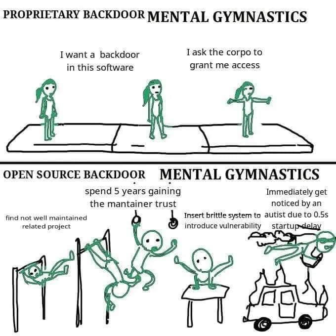

Gần đây tôi xem 1 bộ K-Drama là [Queen of Tears](https://www.netflix.com/vn/title/81707950). Phản diện
phim, từng bước từng bước lấy lòng tin của nhà tài phiệt, rồi lật mặt chơi xấu, kết cấu với gian
dương đại đạo, hi\*p dâm con heo, đẩy bà già xuống biển, phổi bạn xong cho chủ
nhà ra chuồng gà, đương nhiên là chưa tày đâu, nhân vật chính diện rồi cũng giải quyết được thôi. Giống lịch sử Việt Nam
cũng có vài nhân vật từa tựa là Hồ Quý Ly với nhà Trần hay Mạc Đăng Dung với
nhà Lê sơ.

Trong ngành CNTT, cụ thể là an toàn & bảo mật thông tin, hồi tháng 3 cũng có 1 câu truyện sặc mùi drama thế, còn thêm hashtag thao túng tâm lý, chữa lành cho trending nữa cơ, cho ai bảo ngành này toàn đâu to mắt cận EQ thấp. Sau đây tôi sẽ kể lại, vừa để cho nhớ vừa đợi tập 12 của Queen of Tears.

## Lỗ hổng backdoor trong thư viện `xz-utils` hay gaslighting kiểu developer

[XZ utils](https://github.com/tukaani-project/xz) là 1 tool để nén và giải nén dữ liệu, giống [WinRar](https://www.win-rar.com/start.html?&L=0) giải nén file rar, zip ấy. Đơn giản thế nhưng nó được cài đặt sẵn trên hầu hết phiên bản của hệ điều hành Linux, thứ được sử dụng làm server của hơn 90% website ngày nay (số thật đấy, nguồn trust me bro). Chắc các bạn cũng biết, các sản phẩm công nghệ to to đều "đứng" trên vai các project nhỏ hơn của những người đi trước, thậm chí phụ thuộc vào những project của những ông dev ất ở ở xó xỉnh nào đó. Vì không ai thích phát minh lại cái bánh xe cả, trừ T1 ở LCK thích bánh xe bò. Quay lại chủ đề chính, Xz là dự án miễn phí và mã nguồn mở, kiểu giống thông tin cá nhân của bạn, được public tất lên mạng, ai cũng đọc được, nó cũng cho phép cộng đồng cùng đóng góp cho dự án, như sửa lỗi, thêm chức năng, v.v....

Vào 1 ngày đẹp trời tháng 6 năm 2022, 1 thanh niên với account JiaT75 đóng góp những dòng code đầu tiên cho dự án này. Maintainer lâu năm của Xz lúc đó - Lasse Collin, không phải Lily Collins, hẳn phải vui lắm, kiểu có người giúp dự án cho mình mà. Nhưng đồng thời vào thời điểm đó, 1 loạt các tài khoản bắt đầu xuất hiện, phàn nàn với Collin về project, kiểu họ cho rằng project phát triển quá chậm chạp. Các account liên tục pressing Collin, như Liverpool của Klopp năm 19 (chứ đ' phải cò đần trận với Atalanta). Thế là anh maintainer bị stress nặng, code chưa đủ stress hay gì mà còn bị mấy đứa ở đâu blame nữa. Anh mà ở Việt Nam thì tôi đã mời ngay 1 tour lên Sapa healing mấy hôm mà mấy dạo nay tràn lan quảng cáo trên fb. Nhưng mà không, anh không ở Đông Lào, tôi cũng làm gì có tiền mà mời anh, các account kia thì cứ pressing, họ yêu cầu thêm maintainer để đảm bảo tiến độ phát triển của dự án.
JiaT75 hoạt động tích cực, đóng góp nhiều hơn cho XZ, và ngày càng được Collin tin tưởng, cộng hưởng với vấn đề tiến độ kia, Collin dần cho JiaT75 nhiều quyền hơn vào quá trình phát triển project. Bên cạnh việc đóng góp, phát triển, sửa lỗi như 1 maintainer có tâm, JiaT75 bắt đầu thực hiện những dòng code tư lợi cho riêng mình.
JiaT75 đương nhiên là tài khoản ẩn danh, chả ai biết mặt ngang mũi dọc anh ta như nào, nhưng mà quả kế hoạch scam lâu dài này thì chắc cũng mặt quắt tai dơi như anh Quyết. Tháng 3 năm 2024, anh ta update 2 file, những thông tin cuối cùng để tiêm mã độc vào XZ. XZ phiên bản 5.6.1 được phát hành.
1 cách ảo ma canada lazada malaysia nobita làm nhoè đi mascara của shizuka, JiaT75 có thể che giấu những mã độc trong 1 project mà được public cho cả ngàn developer khác ngâm cứu và sử dụng mỗi ngày. Nói về mã độc này thì, hiểu đơn giản là nó cho phép hacker truy cập 1 cách trái phép vào những server chạy hệ điều hành Linux đã tải Xz version 5.6.1. Giống như mở khoá trái tim crush mà chả cần tốn time tán tỉnh hay tiền quà, vì đi đường tắt thế nên gọi là backdoor. Nó cũng được chấm 10/10 trên thang điểm về lỗ hổng bảo mật CVSS score.

Nếu chuyện này mà xảy ra thật, thì ảnh hưởng của nó sẽ rất nghiêm trọng, thử tưởng tượng server của Google hay Facebook bị anh ta truy cập xem, anh ta có thể khiến Jisoo hay Rosé follow account của tôi. Thông tin mật có thể bị đọc trộm, thay thế, giả mạo. Thời đại thông tin này có thể khiến WW3 xảy ra không chừng.
Kịch bản ấy đẹp, mỗi tội nó không xảy ra. Cách JiaT75 tạo ra lỗ hổng ảo diệu như nào thì cách lỗ hổng được phát hiện cũng ảo như vậy. Ngày 29 tháng 3, Andres Freund - 1 lập trình viên của Microsoft, sau khi truy cập vào server của mình đã nhận thấy thời gian truy cập chậm đi 0.5s so với bình thường (bình thường là 0.3s, nhưng sau khi update version mới là 0.8s). Clm 0.5s, nhanh như tôi rep tin nhắn crush. Và Freund cũng để ý, anh thử xem tiến trình nào làm tốn thời gian hơn thì nhận thấy Xz, vốn chỉ để giải nén file, giờ có khi nó giải nén ra vài con virus, worm, malware,... và chúng nó đang party trên tài nguyên CPU. Thế là lỗ hổng này được phát hiện. Freund lập tức gửi mail cho 1 tổ chức bảo mật để thông báo về lỗ hổng này.

Công sức nằm gai nếm mật, kế hoạch scam từ giữa những năm 2022 đến giờ của JiaT75 tan tành. Anh vừa là Software Engineer, vừa là Social Engineer luôn, nếu anh tối ưu code cho chạy nhanh hơn 1 tẹo, nếu anh chịu đợi thêm 1 vài tháng để các server linux update lên version mới (thực tế thì, 1 vài bản beta đã được release như fedora 41) thì câu truyện đã xấu đi nhiều.

Và Jisoo đã có thể follow account của tôi.
